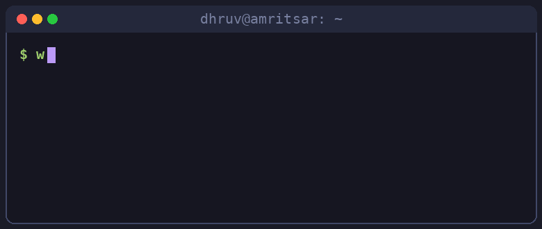

<p align="center">
  
</p>


### `whoami` 

```python
dhruv = {
    "name": "Dhruv Neb",
    "age": 18,
    "base": "Amritsar, Punjab, India",
    "study": "B.Tech @ Guru Nanak Dev University (2026 - 2030)",
    "learning": ["Python for AI", "AI agents"],
    "building": "advancesolutions.co.in",
    "next_up": "TCS CodeVita 2026",
}
```


### right now


- 🐍 learning Python for AI, course in progress
- 🤖 going deep on AI agents: researching, building, breaking, rebuilding
- 🏆 registered for TCS CodeVita 2026
- 🌐 running [advancesolutions.co.in](https://advancesolutions.co.in) on Netlify + Cloudflare

<br clear="right"/>

### meanwhile, in my terminal

<p align="center">
  
</p>


### toolbox

<p>
  
</p>


### 2026 roadmap

- [x] start B.Tech at GNDU
- [x] register for TCS CodeVita
- [ ] ship my first AI agent
- [ ] make my first open-source contribution
- [ ] build in public, one commit at a time


### github stats

<p align="center">
  
</p>
<p align="center">
  
  
</p>


### watch the snake eat my contributions

<picture>
  <source media="(prefers-color-scheme: dark)" srcset="https://raw.githubusercontent.com/dhruvneb/dhruvneb/output/github-contribution-grid-snake-dark.svg" />
  <source media="(prefers-color-scheme: light)" srcset="https://raw.githubusercontent.com/dhruvneb/dhruvneb/output/github-contribution-grid-snake.svg" />
  
</picture>


### connect

<p>
  <a href="https://advancesolutions.co.in"></a>
  <a href="mailto:nebdhruv@gmail.com"></a>
  <a href="https://github.com/dhruvneb"></a>
</p>

<p align="center">
  
</p>


